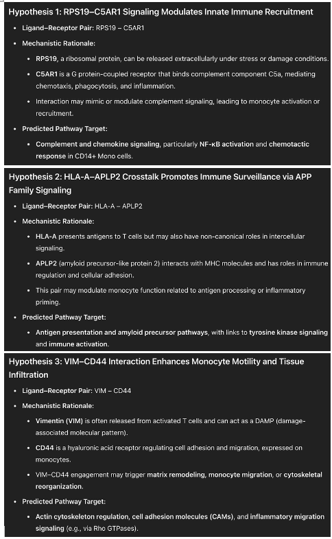

## LIANA+ With CharGPT chatbox tutorial
> To obtain input results from the LIANA+ algorithm, please refer to the [LIANA+ documentation](https://liana-py.readthedocs.io/en/latest/notebooks/basic_usage.html) for generation instructions.


Copy the `prompt words`, and `LIANA result` to the chatGPT chatbox

```bash
prompt
.
├── Enhanced_prompt_Few_shot.txt
├── LLM_Simple_LIANA+_Prompt.txt ⬅
├── LLM_Simple_NicheNet_Prompt.txt
├── example1.txt
├── example2.txt
└── example3.txt
```

Also, replace the content within the {...} brackets in the prompt with your own results.


## Expected Output

