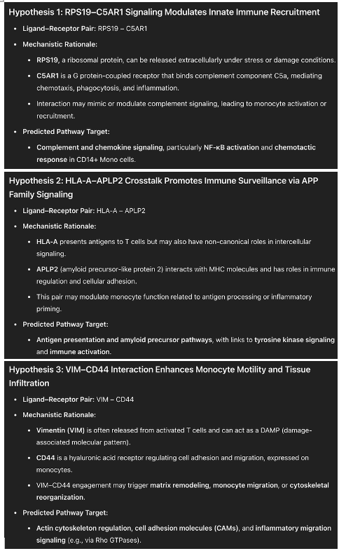

## LIANA+ With CharGPT chatbox tutorial
> To learn more about LIANA+, please refer to the [LIANA+ documentation](https://liana-py.readthedocs.io/en/latest/notebooks/basic_usage.html).

Copy the prompt words, and drag examples, LR_pairs.txt and significant_branches.txt to the chatGPT chatbox

```bash
prompt
.
├── Enhanced_prompt_Few_shot.txt
├── LLM_Simple_LIANA+_Prompt.txt ⬅
├── LLM_Simple_NicheNet_Prompt.txt
├── example1.txt
├── example2.txt
└── example3.txt
```

Also, with the LIANA+ result.


## Expected Output

