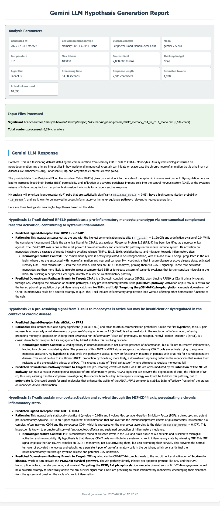

## LIANA+ With Gemini LLM tutorial
> To learn more about LIANA+, please refer to the [LIANA+ documentation](https://liana-py.readthedocs.io/en/latest/notebooks/basic_usage.html).

## Prerequisites
- Python 3.9
- Conda package manager
- Internet connection for downloading packages and models


This demonstration uses the Gemini API, which supports the following models: gemini-2.0-flash, gemini-2.5-flash, and gemini-2.5-pro. For more information, please refer to: [Gemini API docs](https://ai.google.dev/gemini-api/docs?authuser=1)

## Installation Dependencies 
### Step 1: Set Up Python Environment
Create and activate a conda environment:

```bash
conda create -n is2c2 python=3.9
conda activate is2c2
```

### Step 2: Install Python Dependencies
Install the required Python packages:

```bash
pip install -q -r requirements.txt
```


## Prepare the Gemini API Key
This demonstration uses the Gemini API, which supports the following models: gemini-2.0-flash, gemini-2.5-flash, and gemini-2.5-pro. For more information, please refer to: [Gemini API docs](https://ai.google.dev/gemini-api/docs?authuser=1)

Please navigate to the [Gemini Key website](https://aistudio.google.com/apikey) and create your own Gemini API key.


Refer to this [PDF tutorial](../how-to-get-Gemini-Key.pdf) for step-by-step instructions on obtaining your Gemini API key.

---

## Data
The LIANA+ example data are available in [Google Drive](https://drive.google.com/file/d/1ZifaMtldX4lvSkB1YrmA_P1V-YPVIAZM/view?usp=sharing).

**Download the example data** and place it in your working directory before proceeding with the analysis.


---
## Usage

### Running LLM Hypothesis Generation with Liana
### Step 1: Run an Example
```python 
python ./gemini-api-call.py \
--cell "Memory CD4 T-CD14+ Mono" \
--disease "Peripheral Blood Mononuclear Cells" \
--model "gemini-2.5-pro" \
--significant-branches-file "../PBMC_memory_cd4_to_cd14_mono.csv" \
--algorithm "lianaplus" \
--api-key "(your-gemini-api-key)"
```

Explain about the parameters as follows: 

```python
python ./gemini-api-call.py\
--cell "(The cell communication pair for LLM-based hypothesis generation and analysis)" \
--disease "(The disease context for LLM-based hypothesis generation to provide relevant biological context for the analysis.)" \
--model "gemini-2.5-pro" \
--significant-branches-file "(The path to the CSV file containing significant ligand-receptor interaction data with downstream pathway branches)" \
--algorithm "lianaplus" \
--api-key "(your-gemini-api-key)"
```


Explain about the parameters as follows: 

* For more detailed information about the parameters, please refer to [parameter-table](../../parameters.md)
* Result will be saved in the default work-directory: /results


## Expected Output
For more details, see the [example report](../../output/gemini25pro_lianaplus/llm_report_gemini_Memory_CD4_T_CD14+_Mono_Peripheral_Blood_Mononuclear_Cells_gemini_25_pro_lianaplus_20250731_175633.html).

