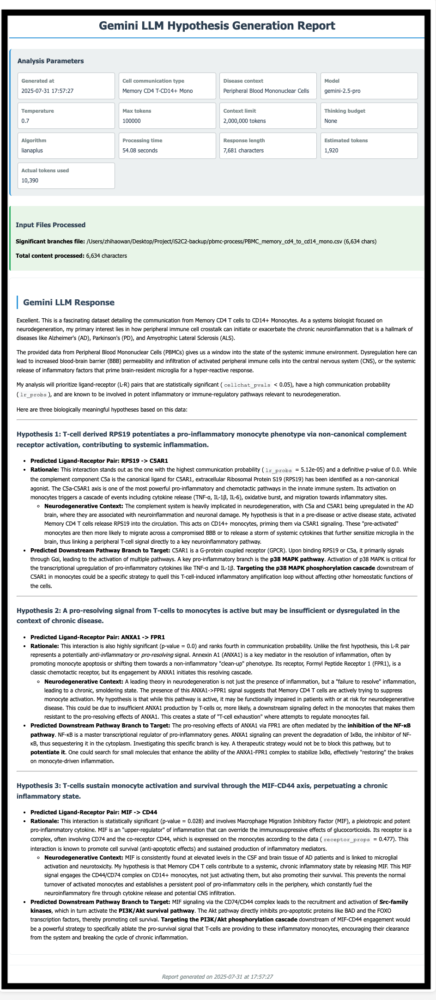

## LIANA+ With Gemini LLM tutorial
> To obtain input results from the LIANA+ algorithm, please refer to the [LIANA+ documentation](https://liana-py.readthedocs.io/en/latest/notebooks/basic_usage.html) for generation instructions.

## Prerequisites
- Python 3.9
- Conda package manager
- Internet connection for downloading packages and models


This demonstration uses the Gemini API, which supports the following models: gemini-2.0-flash, gemini-2.5-flash, and gemini-2.5-pro. For more information, please refer to: [Gemini API docs](https://ai.google.dev/gemini-api/docs?authuser=1)

## Installation Dependencies 
### Step 1: Set Up Python Environment
Create and activate a conda environment:

```bash
conda create -n is2c2 python=3.9
conda activate is2c2
```

### Step 2: Install Python Dependencies
Install the required Python packages:

```bash
pip install -q -r requirements.txt
```


## Prepare the Gemini API Key
This demonstration uses the Gemini API, which supports the following models: gemini-2.0-flash, gemini-2.5-flash, and gemini-2.5-pro. For more information, please refer to: [Gemini API docs](https://ai.google.dev/gemini-api/docs?authuser=1)

Please navigate to the [Gemini Key website](https://aistudio.google.com/apikey) and create your own Gemini API key.


Refer to this [Gemini-key tutorial](../get-gemini-key.md) for step-by-step instructions on obtaining your Gemini API key.

---

## Data
The input data utilizes PBMC3k from SeuratData, which is processed through LIANA+ and CellChat algorithms to generate the results used as input. The processed data is available in [Google Drive](https://drive.google.com/file/d/1ZifaMtldX4lvSkB1YrmA_P1V-YPVIAZM/view?usp=sharing).


---
## Usage

### Running LLM Hypothesis Generation with Liana

Make the pipeline executable:

```bash
chmod +x lianaplus-llm.sh
```
Quick run the analysis with example data using default parameter settings:
### Run an Example
```shell
./lianaplus-llm.sh \
--cell-type "Memory CD4 T-CD14+ Mono" \
--disease-context "Peripheral Blood Mononuclear Cells" \
--llm-provider "gemini" \
--model "gemini-2.5-pro" \
--liana-result "../pbmc-process/PBMC_memory_cd4_to_cd14_mono.csv" \
--api-key "(your-gemini-api-key)"
```

Explain about the parameters as follows: 

```shell
./lianaplus-llm.sh \
--cell-type "(The cell communication pair for LLM-based hypothesis generation and analysis)" \
--disease-context "(The disease context for LLM-based hypothesis generation to provide relevant biological context for the analysis.)" \
--llm-provider "gemini" \
--model "gemini-2.5-pro" \
--liana-result  "(The path to the CSV file containing significant ligand-receptor interaction data with downstream pathway branches from LIANA+ output)" \
--api-key "(your-gemini-api-key)"
```


Explain about the parameters as follows: 

* For more detailed information about the parameters, please refer to [parameter-table](../../parameters.md)
* Result will be saved in the default work-directory: /results


## Expected Output
For more details, see the [example report](https://mocha.houstonmethodist.org/iS2C2/gemini-lianaplus.html).

