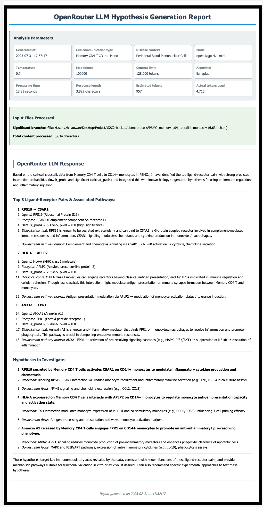

## LIANA+ With OpenAI LLM tutorial
> To obtain input results from the LIANA+ algorithm, please refer to the [LIANA+ documentation](https://liana-py.readthedocs.io/en/latest/notebooks/basic_usage.html) for generation instructions.

This demonstration uses the OpenAI API via Openrouter platform, which supports the [models](https://openrouter.ai/models).

## Prerequisites
- Python 3.9
- Conda package manager
- Internet connection for downloading packages and models

---

## Installation Dependencies 
### Step 1: Set Up Python Environment
Create and activate a conda environment:

```bash
conda create -n is2c2 python=3.9
conda activate is2c2
```

### Step 2: Install Python Dependencies
Install the required Python packages:

```bash
pip install -q -r requirements.txt
```

---

## Prepare the API Key
Please navigate to the [Openrouter Key website](https://openrouter.ai/settings/keys) and create your own Openrouter API key.


Refer to this [openrouter-api-key tutorial](../get-openrouter-key.md) for step-by-step instructions on obtaining your Openrouter API key.

---

## Data
The input data utilizes PBMC3k from SeuratData, which is processed through LIANA+ and CellChat algorithms to generate the results used as input. The processed data is available in [Google Drive](https://drive.google.com/file/d/1ZifaMtldX4lvSkB1YrmA_P1V-YPVIAZM/view?usp=sharing).


---


### Running LLM Hypothesis Generation with S2C2
Make the pipeline executable:

```bash
chmod +x lianaplus-llm.sh
```

Quick run with the example as follows:
```bash
./lianaplus-llm.sh \
--cell-type "Memory CD4 T-CD14+ Mono" \
--disease-context "Peripheral Blood Mononuclear Cells" \
--llm-provider "openrouter" \
--model "openai/gpt-4.1-mini" \
--liana-result "../pbmc-process/PBMC_memory_cd4_to_cd14_mono.csv" \
--api-key "(your-gemini-api-key)"
```

Parameter explainaiton
```bash
python ./openrouter-api-call.py  \
--cell-type "(The cell communication pair for LLM-based hypothesis generation and analysis)" \
--disease-context "(The disease context for LLM-based hypothesis generation to provide relevant biological context for the analysis.)" \
--llm-provider "openrouter" \
--model "openai/gpt-4.1-mini"  \
--api-key "(your-openrouter-api-key)"
```
* For more detailed information about the parameters, please refer to [parameter-table](../../parameters.md)
* Result will be saved in the default work-directory: /results


## Expected Output
For more details, see the [example report](https://mocha.houstonmethodist.org/iS2C2/openai-lianaplus.html).

