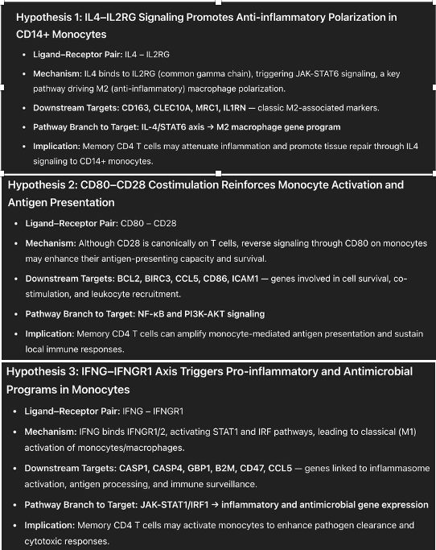

## NicheNet With CharGPT chatbox tutorial
> To obtain input results from the NicheNet algorithm, please refer to the [NicheNet documentation](https://github.com/saeyslab/nichenetr) for generation instructions.

Copy the `prompt words`, the `nichenet_lr_result` and the `nichenet_lt_result` to the chatGPT chatbox

```bash
prompt
.
├── Enhanced_prompt_Few_shot.txt
├── LLM_Simple_LIANA+_Prompt.txt 
├── LLM_Simple_NicheNet_Prompt.txt ⬅
├── example1.txt
├── example2.txt
└── example3.txt
```

Also, replace the content within the {...} brackets in the prompt with your own results.

## Expected Output

