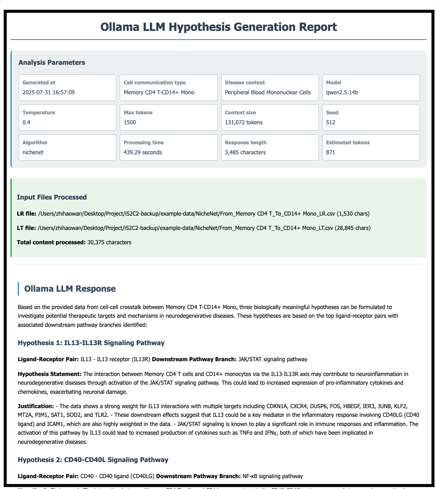

## NicheNet With Ollama LLM tutorial
> To obtain input results from the NicheNet algorithm, please refer to the [NicheNet documentation](https://github.com/saeyslab/nichenetr) for generation instructions.

## Prerequisites
- Python 3.9
- Conda package manager
- Internet connection for downloading packages and models

## Installation of LLM

### Step 1: Set Up Python Environment
Create and activate a conda environment:

```bash
conda create -n is2c2 python=3.9
conda activate is2c2
```

### Step 2: Install Python Dependencies
Install the required Python packages:

```bash
pip install -q -r requirements.txt
```

### Step 3: Install Ollama
1. Visit the [Ollama official website](https://ollama.com/download)
2. Download the installer for your operating system
3. Follow the installation instructions provided

### Step 4: Verify Ollama Installation
Check if the Ollama server is running properly:

```bash
curl http://localhost:11434
```

You should see `Ollama is running`

Alternatively, you can visit http://localhost:11434 in your browser. If the Ollama server is running properly, the browser will display the following:


## Data
The input data utilizes PBMC3k from SeuratData, which is processed through NicheNet algorithm to generate the ligand-receptor and ligand-target interaction results used as input. The processed data is available in [Google Drive](https://drive.google.com/drive/folders/1t1Eq2n1H1loCx78nt6CX9thLGUAusFVB?usp=sharing). The original data source is the same RDS file used in the iS2C2 tutorial.

---

## Usage

### Step 1: Start Ollama Service
```bash
ollama serve
```

### Step 2: Download Language Model
> If you want to use additional models, please refer to the detailed model information on https://ollama.com/search, download your preferred model using ollama pull <model-name>, and then specify it using the --model parameter in your command.
```bash
ollama pull llama3.2
```
> **Note**: If you have access to advanced computing resources such as high-memory GPUs (H100, A100), we recommend using large-parameter open-source models like GPT-oss 120B, Qwen-72B, and DeepSeek-V3-671B to optimize performance and accuracy.

### Step 3: Run an Example

Make the pipeline executable:

```bash
chmod +x nichenet-llm.sh
```

Quick run the analysis with example data using default parameter settings:

```shell
./nichenet-llm.sh \
--cell "Memory CD4 T-CD14+ Mono" \
--disease "Peripheral Blood Mononuclear Cells" \
--model "llama3.2" \
--lr-file "../NicheNet/From_Memory CD4 T_To_CD14+ Mono_LR.csv" \
--lt-file "../NicheNet/From_Memory CD4 T_To_CD14+ Mono_LT.csv" 
```

Explain about the parameters as follows: 

```shell
python ./local-ollama-api.py \
--cell "(The cell communication pair for LLM-based hypothesis generation and analysis)" \
--disease "(The disease context for LLM-based hypothesis generation to provide relevant biological context for the analysis.)" \
--model "(The openmodel pulled from ollama platform)" \
--lr-file "(The path of ligand-receptor interaction data file)" \
--lt-file "(The path of ligand-target interaction data file)"

```
* For more detailed information about the parameters, please refer to [parameter-table](../../parameters.md)
* Result will be saved in the default work-directory: /results


## Expected Output
For more details, see the [example report](https://mocha.houstonmethodist.org/iS2C2/ollama-llama32-nichenet.html).

