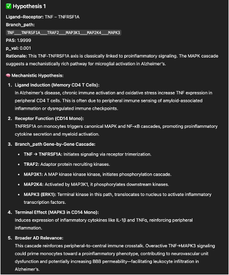
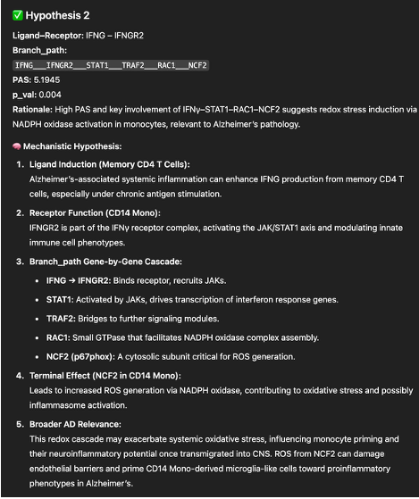
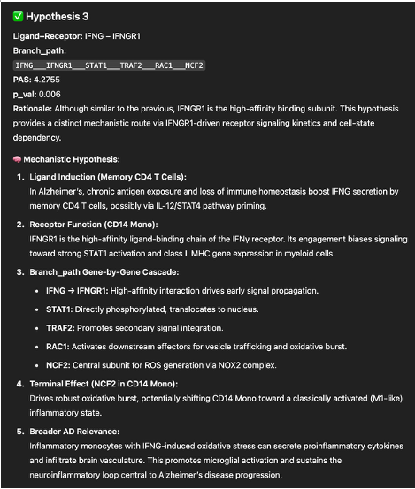

## iS2C2 With CharGPT chatbox tutorial
>If you need the input result that originates from the S2C2 pipeline output, please visit the [S2C2](https://github.com/methodistsmab/S2C2) algorithm.

## Get the result from S2C2
Quick example for running the standalone S2C2 R script. From the root working directory, run the following command line:
```bash
Rscript Rscript/S2C2_CLI.R \
--rds-file ../pbmc_control_example_clean_7_21_25.rds \
--celltype-colname "seurat_annotations" \
--condition-colname "condition" \
--condition1 "control" \
--condition2 "NA" \
--sender "Memory CD4 T" \
--receiver "CD14+ Mono" \
--species "human" \
--assay "RNA" 
```


## Files to Drag into ChatBox

Copy the `prompt words`, and drag `examples`, and `LLM_significant_branches.txt` to the chatGPT chatbox

```bash
prompt
.
├── LLM_Enhanced_Few_Prompt.txt ⬅
├── example1.txt  ⬅
├── example2.txt  ⬅
└── example3.txt  ⬅
```
Also, replace the content within the {...} brackets in the prompt with your own results.


```bash
results/sender_<exampleCellTypeSender>_receiver_<exampleCellTypeReceiver>_NA
.
├── LLM_significant_branches.csv ⬅
....
├── node_table_logFC.txt
├── receiver_overall_NK_T_cell.txt
├── sender_markers_Prolif_Macrophage_DC.txt
└── significant_branches.txt
```


## Expected Output




