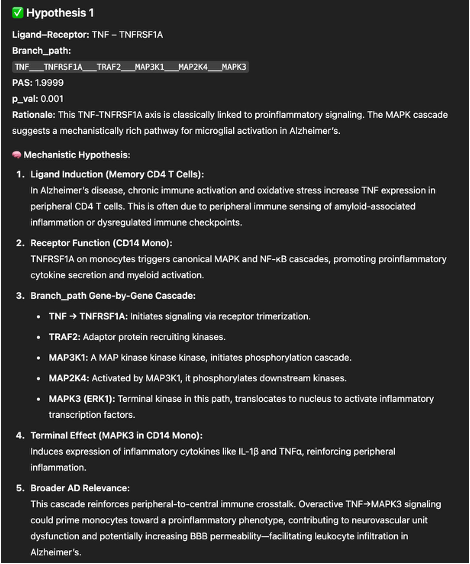
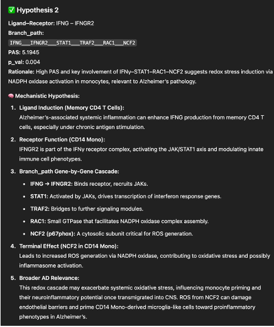
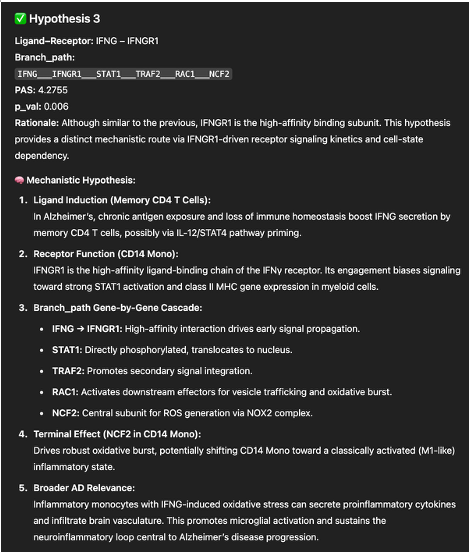

## iS2C2 With CharGPT chatbox tutorial
>To learn more about S2C2, please visit the [S2C2](https://github.com/methodistsmab/S2C2)

Copy the prompt words, and drag examples, and LLM_significant_branches.txt to the chatGPT chatbox

```bash
prompt
.
├── LLM_Enhanced_Few_Prompt.txt ⬅
├── example1.txt  ⬅
├── example2.txt  ⬅
└── example3.txt  ⬅
```


```bash
results/sender_exampleCellTypeSender_receiver_exampleCellTypeReceiver_NA
.
├── LLM_significant_branches.csv ⬅
....
├── node_table_logFC.txt
├── receiver_overall_NK_T_cell.txt
├── sender_markers_Prolif_Macrophage_DC.txt
└── significant_branches.txt
```


## Expected Output




