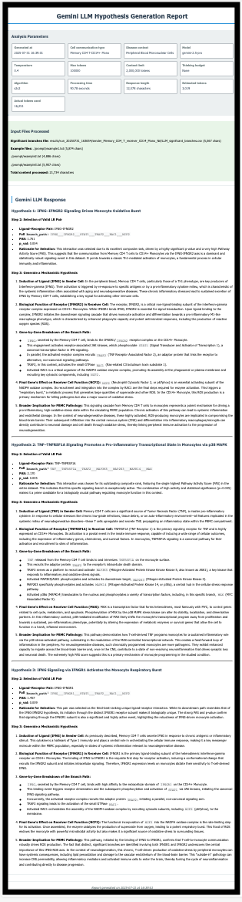

## iS2C2 With Gemini LLM tutorial
>If you need the input result that originates from the S2C2 pipeline output, please visit the [S2C2](https://github.com/methodistsmab/S2C2) algorithm.

## Prerequisites
- Python 3.9
- Conda package manager
- Internet connection for downloading packages and models

## Installation Dependencies 
### Step 1: Set Up Python Environment
Create and activate a conda environment:

```bash
conda create -n is2c2 python=3.9
conda activate is2c2
```

### Step 2: Install Python Dependencies
Install the required Python packages:

```bash
pip install -q -r requirements.txt
```


## Prepare the Gemini API Key
This demonstration uses the Gemini API, which supports the following models: gemini-2.0-flash, gemini-2.5-flash, and gemini-2.5-pro. For more information, please refer to: [Gemini API docs](https://ai.google.dev/gemini-api/docs?authuser=1)

Please navigate to the [Gemini Key website](https://aistudio.google.com/apikey) and create your own Gemini API key.


Refer to this  [Gemini-key tutorial](../get-gemini-key.md) for step-by-step instructions on obtaining your Gemini API key.

## Data
This tutorial analyzes a Peripheral Blood Mononuclear Cells (PBMC) dataset from 10X Genomics, consisting of around 2,700 single cells, using the Seurat package to perform standard single-cell RNA sequencing data preprocessing and clustering.

The example data are available in [Google Drive](https://drive.google.com/file/d/1Ejcch9g5_kcj-0iJnIPnU5s9LmlGEUx8/view?usp=share_link).

## Usage
Make the pipeline executable:

```bash
chmod +x iS2C2.sh
```
Running LLM Hypothesis Generation with S2C2
```bash
./iS2C2.sh \
  --rds-file "./pbmc_control_example_clean_7_21_25.rds" \
  --celltype-colname "seurat_annotations" \
  --condition-colname "condition" \
  --condition1 "control" \
  --condition2 "NA" \
  --sender "Memory CD4 T" \
  --receiver "CD14+ Mono" \
  --species "human" \
  --assay "RNA" \
  --cell-type "Memory CD4 T-CD14+ Mon" \
  --disease-context "Peripheral Blood Mononuclear Cells" \
  --llm-provider "gemini" \
  --model "gemini-2.5-pro" \
  --api-key "(your-gemini-api-key)"
```
Explain about the parameters as follows: 

```bash
./iS2C2.sh \
  --rds-file "example.rds (The Seurat RDS file containing single-cell RNA sequencing data)" \
  --celltype-colname "(The column name in the Seurat object's metadata that contains the cell type annotations)" \
  --condition-colname "(The column name in the Seurat object's metadata that contains the experimental condition or phenotype labels)" \
  --condition1 "(The primary condition value)" \
  --condition2 "(the secondary condition value)" \
  --sender "(Sender cell type)" \
  --receiver "(Receiver cell type)" \
  --species "(The species of the input data)" \
  --assay "(The data slot to use from the Seurat object)" \
  --cell-type "(The cell communication pair for LLM-based hypothesis generation and analysis)" \
  --disease-context "(The disease context for LLM-based hypothesis generation to provide relevant biological context for the analysis.)" \
  --llm-provider "gemini" \
  --model "gemini-2.5-pro" \
  --api-key "(you-gemini-api-key)"
```
* For more detailed information about the parameters, please refer to [parameter-table](../../parameters.md)
* Result will be saved in the default work-directory: /results

> **Note**: Results will be saved in the default working directory: `/results`.


## Expected Output
For more details, see the [example report](https://mocha.houstonmethodist.org/iS2C2/gemini-s2c2.html).

