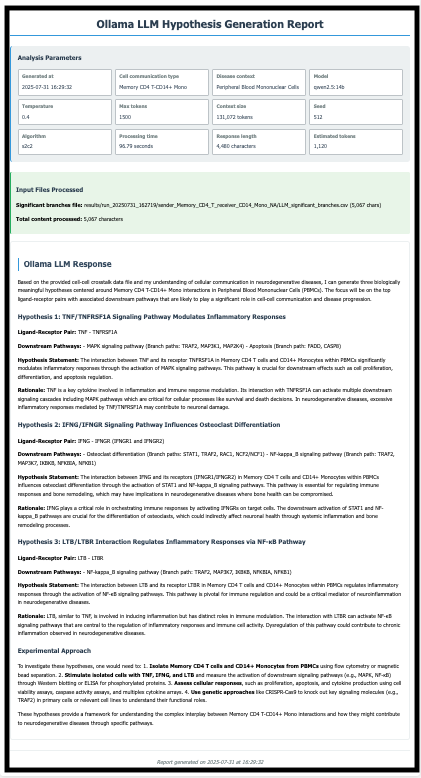

## iS2C2 With Ollama LLM Tutorial
>If you need the input result that originates from the S2C2 pipeline output, please visit the [S2C2](https://github.com/methodistsmab/S2C2) algorithm.

## Prerequisites
- R version 4.3.1 or higher
- Python 3.9
- Conda package manager
- Internet connection for downloading packages and models

## Installation of iS2C2

For detailed algorithm information, please refer to our [S2C2](https://github.com/methodistsmab/S2C2) GitHub repository.

### Step 1: Install R Dependencies
Install the required R packages:

```bash
Rscript -e "install.packages(c('Seurat', 'SingleCellExperiment', 'openxlsx', 'optparse', 'presto', 'jsonlite', 'DescTools', 'plyr', 'dplyr', 'homologene', 'ggplot2', 'reshape2', 'stringr'), repos='https://cran.rstudio.com/')"
```

> **Note for Linux users**: Some Bioconductor packages like SingleCellExperiment may need to be installed manually using BiocManager.

### Step 2: Set Up Python Environment
Create and activate a conda environment:

```bash
conda create -n is2c2 python=3.9
conda activate is2c2
```

### Step 3: Install Python Dependencies
Install the required Python packages:

```bash
pip install -q -r requirements.txt
```

### Step 4: Install Ollama
1. Visit the [Ollama official website](https://ollama.com/download)
2. Download the installer for your operating system
3. Follow the installation instructions provided

### Step 5: Verify Ollama Installation
Check if the Ollama server is running properly:

```bash
curl http://localhost:11434
```

You should see `Ollama is running`

Alternatively, you can visit http://localhost:11434 in your browser. If the Ollama server is running properly, the browser will display the following:


## Data
This tutorial analyzes a Peripheral Blood Mononuclear Cells (PBMC) dataset from 10X Genomics, consisting of around 2,700 single cells, using the Seurat package to perform standard single-cell RNA sequencing data preprocessing and clustering.

The example data are available in [Google Drive](https://drive.google.com/file/d/1Ejcch9g5_kcj-0iJnIPnU5s9LmlGEUx8/view?usp=share_link).

## Usage

### Step 1: Start Ollama Service

```bash
ollama serve
```

### Step 2: Download Language Model

```bash
ollama pull llama3.2
```

> **Note**: If you want to use additional models, please refer to the detailed model information on https://ollama.com/search, download your preferred model using `ollama pull <model-name>`, and then specify it using the `--model` parameter in your command.

### Step 3: Prepare the Pipeline
Make the pipeline executable:

```bash
chmod +x iS2C2.sh
```

### Step 4: Run Example Analysis
Run the analysis with example data using default parameter settings:

```bash
./iS2C2.sh \
  --rds-file "./pbmc_control_example_clean_7_21_25.rds" \
  --celltype-colname "seurat_annotations" \
  --condition-colname "condition" \
  --condition1 "control" \
  --condition2 "NA" \
  --sender "Memory CD4 T" \
  --receiver "CD14+ Mono" \
  --species "human" \
  --assay "RNA" \
  --cell-type "Memory CD4 T-CD14+ Mono" \
  --disease-context "Peripheral Blood Mononuclear Cells" \
  --llm-provider "ollama" \
  --model "llama3.2:latest" 
```

Explain about the parameters as follows: 

```bash
./iS2C2.sh \  
  --rds-file "example.rds (The Seurat RDS file containing single-cell RNA sequencing data)" \
  --celltype-colname "(The column name in the Seurat object's metadata that contains the cell type annotations)" \
  --condition-colname "(The column name in the Seurat object's metadata that contains the experimental condition or phenotype labels)" \
  --condition1 "(The primary condition value)" \
  --condition2 "(the secondary condition value)" \
  --sender "(Sender cell type)" \
  --receiver "(Receiver cell type)" \
  --species "(The species of the input data)" \
  --assay "(The data slot to use from the Seurat object)" \
  --cell-type "(The cell communication pair for LLM-based hypothesis generation and analysis)" \
  --disease-context "(The disease context for LLM-based hypothesis generation to provide relevant biological context for the analysis.)" \
  --llm-provider "LLM provider: "ollama", "gemini", or "openrouter" (default: ollama)" \
  --model "llama3.2:latest" 
```
* For more detailed information about the parameters, please refer to [parameter-table](../../parameters.md)
* Result will be saved in the default work-directory: /results

> **Note**: Results will be saved in the default working directory: `/results`.

## Expected Output
For more details, see the [example report](https://mocha.houstonmethodist.org/iS2C2/ollama-llama32-s2c2.html).

